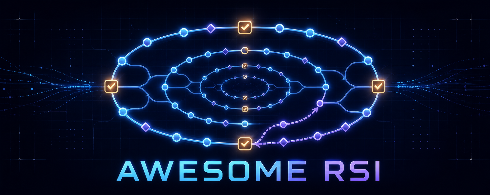

# ♻️ Awesome Recursive Self-Improvement

**A curated, high-signal index of recursive self-improvement (RSI) in AI: foundations, self-modifying agents, evaluation, and safety.**

_Last reviewed: 2026-08-18._

> [!IMPORTANT]
> **RSI is stronger than ordinary iteration.** This list distinguishes systems that improve a persistent part of themselves from systems that merely revise one answer. A recursive system must also improve, or repeatedly reuse, the mechanism that produces later improvements. Most current systems are bounded or partial RSI—not open-ended intelligence explosions.

## Contents

- [Scope and labels](#scope-and-labels)
- [Start here](#start-here)
- [Surveys and taxonomies](#surveys-and-taxonomies)
- [Foundations](#foundations)
- [Self-modifying and recursively improving agents](#self-modifying-and-recursively-improving-agents)
- [Components of self-improvement](#components-of-self-improvement)
- [Automated AI research](#automated-ai-research)
- [Software-engineering self-improvement](#software-engineering-self-improvement)
- [Evaluation and benchmarks](#evaluation-and-benchmarks)
- [Safety, limits, and governance](#safety-limits-and-governance)
- [Self-improvement harnesses](#self-improvement-harnesses)
- [Workshops and related collections](#workshops-and-related-collections)

## Scope and labels

This list uses three labels to keep adjacent research useful without overstating what it demonstrates:

- **`RSI`** - the system changes a persistent part of itself, evaluates the change, and applies the same or an improved process again.
- **`Self-improvement`** - the system persistently improves model weights, prompts, memory, tools, skills, or scaffolding, but the improvement operator itself remains fixed.
- **`Enabler`** - automated research, optimization, evaluation, or safety work that could support RSI but is not itself RSI.

Excluded by default: one-shot self-critique, answer-only refinement with no persistent update, generic agent frameworks, and projects whose improvement claims have no reproducible evaluation.

### Inclusion decision

| System behavior | Included? | Label |
| --- | --- | --- |
| Revises only the current answer, with no reusable state | Usually no | Output refinement |
| Generates, filters, or repairs data and trains a later model on it | Yes | `Self-improvement` if the data loop is system-driven |
| Stores experience that changes later behavior | Yes | `Self-improvement` when reuse is demonstrated; otherwise `Enabler` |
| Updates prompts, memory, tools, skills, routing, permissions, or executable control logic | Yes | `Self-improvement` |
| Improves the updater, evaluator, mutation policy, or harness engineer used in later rounds | Yes | `RSI` candidate |
| Optimizes an external artifact while the agent remains fixed | Yes, in an adjacent section | `Enabler` |

The unit of analysis is the **deployed agent system**, not only its neural weights. Model, data, prompt, memory, tool, workflow, harness, evaluator, and environment are all legitimate update surfaces, but changing a surface is not automatically recursive improvement.

## Start here

- [`RSI` Recursive Self-Improvement in AI: From Bounded Self-Refinement to Autonomous Research Loops](https://arxiv.org/abs/2607.07663) (2026) - Broad survey organizing self-improvement by what changes and who verifies the change.
- [`RSI` From Seed AI to Technological Singularity via Recursively Self-Improving Software](https://arxiv.org/abs/1502.06512) (2015) - Definitions, prior work, computational limits, and RSI convergence theory.
- [`RSI` Gödel Machines: Self-Referential Universal Problem Solvers Making Provably Optimal Self-Improvements](https://arxiv.org/abs/cs/0309048) (2003) - The classic formal architecture for provably useful self-rewrites.
- [`RSI` Gödel Agent](https://arxiv.org/abs/2410.04444) (ACL 2025) - A self-referential LLM agent that edits its own logic rather than following a fixed hand-authored optimizer. [Code](https://github.com/Arvid-pku/Godel_Agent)
- [`RSI` Darwin Gödel Machine](https://arxiv.org/abs/2505.22954) (2025) - Open-ended evolution of coding agents through self-modification, empirical evaluation, and an archive of variants. [Code](https://github.com/jennyzzt/dgm)
- [`RSI` A Self-Improving Coding Agent (SICA)](https://arxiv.org/abs/2504.15228) (2025) - A coding agent repeatedly edits and benchmarks its own codebase. [Code](https://github.com/MaximeRobeyns/self_improving_coding_agent)
- [`Self-improvement` OpenRSI / OpenMLE / Frontis-MA1](https://arxiv.org/abs/2607.28568) (2026) - A full-stack AI4AI release from Horizon Research, Frontis.AI, and Tsinghua University, joining executable task environments, learned improvement operators, long-horizon program evolution, and held-out transfer evaluation. [Code](https://github.com/FrontisAI/OpenRSI)
- [`Enabler` Diving into Reliable Self-Evolving Agents](https://openreview.net/forum?id=CGO1hDTHNe) (2026) - A five-level taxonomy separating output, model, scaffold, improver, and criterion evolution, with reliability requirements for each level. [Collection](https://github.com/wkqdzkd/Awesome-Reliable-Self-Evolving-Agents)

## Surveys and taxonomies

- [Self-Improvements in Modern Agentic Systems: A Survey](https://arxiv.org/abs/2607.13104) (2026) - A 239-paper map separating foundation-model improvement from prompt, memory, tool, and full-scaffolding improvement. [Living list](https://github.com/selfimproving-agent/Awesome-Self-Improving-Agents)
- [Recursive Self-Improvement in AI: From Bounded Self-Refinement to Autonomous Research Loops](https://arxiv.org/abs/2607.07663) (2026) - Distinguishes bounded refinement, persistent self-improvement, recursive improvement, and autonomous research loops.
- [A Survey of Self-Evolving Agents: What, When, How, and Where to Evolve](https://arxiv.org/abs/2507.21046) (TMLR 2026) - Organizes model, memory, tool, and architecture evolution by update time, feedback, and single- versus multi-agent design.
- [A Comprehensive Survey of Self-Evolving AI Agents](https://arxiv.org/abs/2508.07407) (2025) - Unifies system inputs, agent systems, environments, and optimizers, including domain-specific evolution and safety.
- [A Survey on Self-Evolution of Large Language Models](https://arxiv.org/abs/2404.14387) (2024) - Frames model self-evolution as repeated experience acquisition, refinement, updating, and evaluation. [Living list](https://github.com/AlibabaResearch/DAMO-ConvAI/tree/main/Awesome-Self-Evolution-of-LLM)
- [Self-Improving Agents in the Era of Experience: A Survey of Self- to Meta-Evolution](https://openreview.net/forum?id=IUltZSgLMm) (2026) - Treats the harness as experience infrastructure connecting skills, memory, environments, continual learning, and meta-evolution.
- [Towards Persistent Growth: A Survey on Self-Evolving Agents from a Lifelong Learning Perspective](https://dsa.hkust-gz.edu.cn/blog/2026/06/05/towards-persistent-growth-a-survey-on-self-evolving-agents-from-a-lifelong-learning-perspective/) (2026) - Requires persistent, reusable, behaviorally consequential change across episodes rather than within-episode retry.
- [Diving into Reliable Self-Evolving Agents](https://openreview.net/forum?id=CGO1hDTHNe) (2026) - Adds reliability requirements for scaffold-, improver-, and criterion-level evolution.
- [A Systematic Survey of Self-Evolving Agents: From Model-Centric to Environment-Driven Co-Evolution](https://doi.org/10.36227/techrxiv.177203250.05832634/v2) (2026) - Extends the scope to agent–environment co-evolution. [Collection](https://github.com/XMUDeepLIT/Awesome-Self-Evolving-Agents)
- [The Path to Recursive Self-Improving Agents: Foundation, Framework, and Future Directions](https://www.preprints.org/manuscript/202608.0051) (2026) - Grades agent self-improvement from manual updates through general RSI and separates harness, data-system, trainer, and cross-component evolution. [Living list](https://github.com/D2I-ai/awesome-recursive-self-improving-agents)
- [From Static Templates to Dynamic Runtime Graphs: A Survey of Workflow Optimization for LLM Agents](https://arxiv.org/abs/2603.22386) (2026) - Organizes agentic computation-graph optimization by when structure changes, which components change, and which signals guide the update.
- [Agent Harness Engineering: A Survey](https://openreview.net/forum?id=eONq7FdiHa) (2026) - Surveys runtime harness components, lifecycle adaptation, evaluation, and the distinction between model and interface improvement.
- [Automated Design of Agentic Systems: A Survey of Algorithms for Searching, Optimizing, and Evolving LLM Agents, Workflows, and Prompts](https://www.preprints.org/manuscript/202606.0238) (2026) - Compares search spaces, feedback signals, representations, transfer, cost, and safety across prompt optimizers, workflow search, and self-rewriting agents.

## Foundations

### Concepts and formal models

- [Speculations Concerning the First Ultraintelligent Machine](https://www.sciencedirect.com/science/article/pii/S0065245808604180) (I. J. Good, 1965) - Introduced the intelligence-explosion argument.
- [Gödel Machines](https://arxiv.org/abs/cs/0309048) (Jürgen Schmidhuber, 2003) - A proof-searching agent that rewrites any part of itself after proving a utility gain.
- [Basic AI Drives](https://selfawaresystems.com/wp-content/uploads/2008/01/ai_drives_final.pdf) (Stephen Omohundro, 2008) - Instrumental pressures that can arise in sufficiently capable goal-directed systems.
- [Intelligence Explosion Microeconomics](https://intelligence.org/files/IEM.pdf) (Eliezer Yudkowsky, 2013) - A detailed treatment of returns, bottlenecks, and dynamics in recursive improvement.
- [From Seed AI to Technological Singularity via Recursively Self-Improving Software](https://arxiv.org/abs/1502.06512) (Roman Yampolskiy, 2015) - A taxonomy and critical analysis of RSI software.
- [The Surprising Creativity of Digital Evolution](https://arxiv.org/abs/1803.03453) (Lehman et al., 2020) - Examples of unexpected solutions in evolutionary computation and lessons for open-ended search.
- [Open-Endedness: The Last Grand Challenge You've Never Heard Of](https://arxiv.org/abs/1710.09974) (Stanley et al., 2017) - Why continually generating novelty is distinct from optimizing a fixed objective.

### Pre-LLM stepping stones

- [POWERPLAY](https://arxiv.org/abs/1112.5309) (2011) - Jointly searches for a new task and a solver modification that preserves old skills while adding or accelerating a validated capability.
- [Learning to Learn by Gradient Descent by Gradient Descent](https://arxiv.org/abs/1606.04474) (NeurIPS 2016) - Learns an optimizer, a central mechanism for improving the improvement process.
- [Population Based Training of Neural Networks](https://arxiv.org/abs/1711.09846) (2017) - Jointly evolves parameters and hyperparameters during training. [Overview](https://deepmind.google/blog/population-based-training-of-neural-networks/)
- [Paired Open-Ended Trailblazer (POET)](https://arxiv.org/abs/1901.01753) (2019) - Co-evolves environment challenges and their solutions, transferring stepping-stone policies between an expanding set of tasks.
- [AI-GAs: AI-Generating Algorithms](https://arxiv.org/abs/1905.10985) (2019) - Proposes jointly learning architectures, learning algorithms, and environments as an alternative to manually assembling increasingly general AI systems.
- [AutoML-Zero](https://arxiv.org/abs/2003.03384) (ICML 2020) - Evolves complete machine-learning algorithms from primitive operations. [Code](https://github.com/google-research/google-research/tree/master/automl_zero)
- [Mastering Atari, Go, Chess and Shogi by Planning with a Learned Model](https://arxiv.org/abs/1911.08265) (Nature 2020) - MuZero as a landmark self-play and learned-model system; adjacent, not recursive self-modification.

## Self-modifying and recursively improving agents

| Year | Work | Level | What changes |
| ---: | --- | --- | --- |
| 2023 | [Self-Taught Optimizer (STOP)](https://arxiv.org/abs/2310.02304) · [Code](https://github.com/microsoft/stop) | `RSI` | An LLM improves a program that is itself used to improve code. |
| 2024 | [Automated Design of Agentic Systems (ADAS)](https://arxiv.org/abs/2408.08435) · [Code](https://github.com/ShengranHu/ADAS) | `Self-improvement` | A meta-agent searches over agent programs; the meta-optimizer stays fixed. |
| 2024 | [AFlow: Automating Agentic Workflow Generation](https://arxiv.org/abs/2410.10762) · [Code](https://github.com/FoundationAgents/AFlow) | `Self-improvement` | Agent workflows are generated and refined against task feedback. |
| 2025 | [Gödel Agent](https://arxiv.org/abs/2410.04444) · [Code](https://github.com/Arvid-pku/Godel_Agent) | `RSI` | The agent dynamically modifies its own task-solving and optimization logic. |
| 2025 | [A Self-Improving Coding Agent (SICA)](https://arxiv.org/abs/2504.15228) · [Code](https://github.com/MaximeRobeyns/self_improving_coding_agent) | `RSI` | A coding agent edits and evaluates its own implementation. |
| 2025 | [Darwin Gödel Machine](https://arxiv.org/abs/2505.22954) · [Code](https://github.com/jennyzzt/dgm) | `RSI` | An archive-based evolutionary loop modifies coding-agent code and reuses improved descendants. |
| 2026 | [Huxley-Gödel Machine](https://arxiv.org/abs/2510.21614) · [Code](https://github.com/metauto-ai/HGM) | `RSI` | An empirical approximation of a Gödel machine develops its own coding-agent implementation. |
| 2026 | [HyperAgents](https://arxiv.org/abs/2603.19461) · [Code](https://github.com/facebookresearch/HyperAgents) | `RSI` | Task and meta-agent roles are integrated so the agent can modify its own improver. |
| 2026 | [MOSS](https://arxiv.org/abs/2605.22794) · [Code](https://github.com/hkgai-official/Moss) | `RSI` | An agent rewrites its TypeScript source, replays failure batches, and promotes container images through an approval and rollback gate. |
| 2026 | [EvoTrainer](https://arxiv.org/abs/2606.03108) · [Code](https://github.com/AlibabaResearch/DAMO-ConvAI/tree/main/EvoTrainer) | `RSI` | Model policies and their training harnesses co-evolve under executable feedback. |
| 2026 | [SIA: Self Improving AI with Harness & Weight Updates](https://arxiv.org/abs/2605.27276) · [Code](https://github.com/hexo-ai/sia) | `Self-improvement` | A meta-agent updates both task harnesses and model weights under benchmark feedback. |
| 2026 | [Red Queen Gödel Machine](https://arxiv.org/abs/2606.26294) | `RSI` | Agents and their evaluators co-evolve through epoch-bounded utility updates, making the improvement criterion part of the loop. |
| 2026 | [OpenRSI / OpenMLE / Frontis-MA1](https://arxiv.org/abs/2607.28568) · [Code](https://github.com/FrontisAI/OpenRSI) | `Self-improvement` | The Tsinghua-affiliated release joins OpenMLE-Gym, OpenMLE-RL, Frontis-MA1, and OpenMLE-Evo in an executable MLE research stack. |
| 2026 | [Ouroboros](https://arxiv.org/abs/2608.08311) · [Code](https://github.com/razzant/ouroboros) | `RSI` | Reviewed commits to tools, prompts, context assembly, and core code become the runtime for later work and can schedule another evolution cycle. |

## Components of self-improvement

These works improve a persistent component and are important building blocks, but generally keep the outer improvement algorithm fixed.

### Model weights, generated data, and evolving curricula

Data evolution belongs here when generated experience is **persisted, selected or repaired, and consumed by a later update**. Static synthetic-data generation without a feedback-to-update loop is an enabler rather than self-improvement.

- [`Self-improvement` Large Language Models Can Self-Improve](https://arxiv.org/abs/2210.11610) (EMNLP 2023) - Iterative self-generated rationales improve reasoning without new human labels.
- [`Self-improvement` Self-Instruct](https://arxiv.org/abs/2212.10560) (ACL 2023) - Bootstraps instruction-following data from a model's own generations. [Code](https://github.com/yizhongw/self-instruct)
- [`Self-improvement` STaR: Self-Taught Reasoner](https://arxiv.org/abs/2203.14465) (NeurIPS 2022) - Alternates rationale generation and fine-tuning. [Code](https://github.com/ezelikman/STaR)
- [`Self-improvement` Self-Play Fine-Tuning (SPIN)](https://arxiv.org/abs/2401.01335) (ICML 2024) - Uses successive model checkpoints as players in a self-play objective. [Code](https://github.com/uclaml/SPIN)
- [`Self-improvement` Self-Rewarding Language Models](https://arxiv.org/abs/2401.10020) (2024) - The model generates both candidate responses and preference judgments for iterative training.
- [`Self-improvement` Reinforced Self-Training (ReST)](https://arxiv.org/abs/2308.08998) (2023) - Repeatedly generates a dataset with the current policy and improves that policy through reward-filtered offline training.
- [`Self-improvement` Meta-Rewarding Language Models](https://arxiv.org/abs/2407.19594) (2024) - Adds a meta-judge that critiques the model's own judgments so both task behavior and the evaluator improve across training rounds.
- [`Self-improvement` Quiet-STaR](https://arxiv.org/abs/2403.09629) (2024) - Trains models to generate useful internal rationales broadly across text. [Code](https://github.com/ezelikman/quiet-star)
- [`Self-improvement` Self-Adapting Language Models (SEAL)](https://arxiv.org/abs/2506.10943) (2025) - Generates its own update directives and training data for persistent adaptation. [Code](https://github.com/Continual-Intelligence/SEAL)
- [`Self-improvement` SELF: Self-Evolution with Language Feedback](https://arxiv.org/abs/2310.00533) (2024) - Converts model feedback into improved responses and parameter updates.
- [`Self-improvement` SELF-GUIDE](https://arxiv.org/abs/2407.12874) (COLM 2024) - Produces task-specific synthetic instruction data for fine-tuning. [Code](https://github.com/zhaochenyang20/Prompt2Model-Self-Guide)
- [`Self-improvement` DIVE](https://arxiv.org/abs/2501.00747) (2025) - Diversifies and filters self-generated reasoning data across iterative training rounds. [Code](https://github.com/qinyiwei/DIVE)
- [`Self-improvement` LADDER](https://arxiv.org/abs/2503.00735) (2025) - Recursively decomposes problems to generate training experience for later model updates.
- [`Self-improvement` Test-Time Reinforcement Learning](https://arxiv.org/abs/2504.16084) (NeurIPS 2025) - Derives pseudo-rewards from unlabeled test distributions for online parameter adaptation. [Code](https://github.com/PRIME-RL/TTRL)
- [`Self-improvement` Self-Evolving Curriculum for LLM Reasoning](https://arxiv.org/abs/2505.14970) (2025) - Evolves the task curriculum jointly with reasoning training. [Code](https://github.com/ServiceNow/sec)
- [`Self-improvement` Learning to Reason without External Rewards](https://arxiv.org/abs/2505.19590) (ICLR 2026) - Uses intrinsic confidence signals for self-training. [Code](https://github.com/sunblaze-ucb/Intuitor)
- [`Self-improvement` Absolute Zero](https://arxiv.org/abs/2505.03335) (2025) - A single model proposes code-grounded tasks at its learning frontier, solves them, and trains from executable rewards without external data. [Code](https://github.com/LeapLabTHU/Absolute-Zero-Reasoner)
- [`Self-improvement` R-Zero](https://arxiv.org/abs/2508.05004) (ICLR 2026) - Co-evolves challenger and solver models to generate a targeted reasoning curriculum from zero seed tasks or labels. [Code](https://github.com/Chengsong-Huang/R-Zero)
- [`Self-improvement` SAGE](https://arxiv.org/abs/2603.15255) (2026) - Multi-agent generation and selection of reasoning experience for model evolution.
- [`Self-improvement` ANDES](https://arxiv.org/abs/2606.01279) (2026) - An agent-native tool that evolves instruction data through synthesis, verification, and alignment updates. [Code](https://github.com/zzy1127/ANDES)
- [`Self-improvement` WebRL](https://arxiv.org/abs/2411.02337) (ICLR 2025) - Trains web agents with a self-evolving online curriculum grounded in executable interaction. [Code](https://github.com/THUDM/WebRL)
- [`Self-improvement` RAGEN](https://arxiv.org/abs/2504.20073) (2025) - Studies self-evolution through multi-turn agent reinforcement learning. [Code](https://github.com/mll-lab-nu/RAGEN)

### Prompts, memory, tools, and skills

- [`Enabler` Reflexion](https://arxiv.org/abs/2303.11366) (NeurIPS 2023) - Stores verbal feedback in episodic memory to improve later attempts. [Code](https://github.com/noahshinn/reflexion)
- [`Enabler` Self-Refine](https://arxiv.org/abs/2303.17651) (NeurIPS 2023) - Iterative feedback and revision without parameter updates. [Code](https://github.com/madaan/self-refine)
- [`Self-improvement` Voyager](https://arxiv.org/abs/2305.16291) (2023) - Builds and reuses an executable skill library through environment interaction. [Code](https://github.com/MineDojo/Voyager)
- [`Self-improvement` Dynamic Cheatsheet](https://arxiv.org/abs/2504.07952) (2025) - Maintains a self-curated memory of transferable strategies and validated code across otherwise independent inference tasks. [Code](https://github.com/suzgunmirac/dynamic-cheatsheet)
- [`Self-improvement` ReasoningBank](https://arxiv.org/abs/2509.25140) (ICLR 2026) - Distills reusable strategies from self-judged successes and failures, retrieves them for later tasks, and writes new lessons back into persistent reasoning memory. [Code](https://github.com/google-research/reasoning-bank)
- [`Self-improvement` Optimization by PROmpting (OPRO)](https://arxiv.org/abs/2309.03409) (ICLR 2024) - Uses an LLM as an optimizer over natural-language prompts.
- [`Self-improvement` Promptbreeder](https://arxiv.org/abs/2309.16797) (2023) - Evolves task prompts together with mutation prompts, making it unusually close to meta-improvement.
- [`Self-improvement` Eureka](https://arxiv.org/abs/2310.12931) (ICLR 2024) - Evolves reward programs using environment feedback. [Code](https://github.com/eureka-research/Eureka)
- [`Self-improvement` TextGrad](https://arxiv.org/abs/2406.07496) (2024) - Optimizes compound AI systems through textual feedback. [Code](https://github.com/zou-group/textgrad)
- [`Self-improvement` GEPA](https://arxiv.org/abs/2507.19457) (2025) - Reflective, Pareto-based evolution of prompts and other textual components. [Code](https://github.com/gepa-ai/gepa)
- [`Self-improvement` SkillOpt](https://arxiv.org/abs/2605.23904) (2026) - Optimizes reusable natural-language skills through trajectory-driven edits and held-out validation gates. [Code](https://github.com/microsoft/SkillOpt)
- [`Self-improvement` SkillHone](https://arxiv.org/abs/2606.08671) (2026) - Evolves whole skill packages while retaining evaluation and promotion decisions as auditable Git artifacts. [Code](https://github.com/Tencent/SkillHone)
- [`RSI` Who Grades the Grader?](https://arxiv.org/abs/2607.12790) (2026) - Co-evolves an inspectable evaluation metric with an agent skill library, exposing criterion drift as part of the loop. [Code](https://github.com/amazon-science/Self-Evolving-Agents-Double-Ratchet)
- [`Self-improvement` SkillWeaver](https://arxiv.org/abs/2504.07079) (2025) - Discovers and hones reusable web-agent skills through environment exploration. [Code](https://github.com/OSU-NLP-Group/SkillWeaver)
- [`Self-improvement` Alita](https://arxiv.org/abs/2505.20286) (2025) - Builds reusable tools with minimal predefined scaffolding. [Code](https://github.com/CharlesQ9/Alita)
- [`Self-improvement` Agentic Context Engineering](https://arxiv.org/abs/2510.04618) (ICLR 2026) - Evolves context and reusable playbooks from execution feedback. [Code](https://github.com/ace-agent/ace)
- [`Self-improvement` MemRL](https://arxiv.org/abs/2601.03192) (2026) - Applies runtime reinforcement learning to episodic-memory selection. [Code](https://github.com/MemTensor/MemRL)
- [`Self-improvement` Mem²Evolve](https://arxiv.org/abs/2604.10923) (ACL 2026) - Co-evolves capability expansion with experience distillation into memory. [Code](https://github.com/BUAA-IRIP-LLM/Mem2Evolve)
- [`Self-improvement` CoEvoSkills](https://arxiv.org/abs/2604.01687) (COLM 2026) - Co-evolves reusable skills and their verification process. [Code](https://github.com/Zhang-Henry/CoEvoSkills)
- [`Self-improvement` OpenSkill](https://arxiv.org/abs/2606.06741) (2026) - Builds skills and verification signals in open-world environments. [Code](https://github.com/OpenLAIR/OpenSkill)

## Automated AI research

Automating AI R&D can close an important part of the RSI loop, but these systems usually optimize an external artifact rather than their own improvement procedure.

- [`Enabler` MLAgentBench](https://arxiv.org/abs/2310.03302) (ICML 2024) - Agents execute iterative ML experiments on research tasks. [Code](https://github.com/snap-stanford/MLAgentBench)
- [`Enabler` The AI Scientist](https://arxiv.org/abs/2408.06292) (2024) - End-to-end idea generation, experiments, writing, and review. [Code](https://github.com/SakanaAI/AI-Scientist)
- [`Enabler` AIDE](https://arxiv.org/abs/2502.13138) (2025) - Tree-search ML engineering agent for iterative experiment design. [Code](https://github.com/WecoAI/aideml)
- [`Enabler` AlphaEvolve](https://arxiv.org/abs/2506.13131) (2025) - Evolutionary coding agent for algorithmic and scientific discovery; it improves target programs, not itself.
- [`Enabler` autoresearch](https://github.com/karpathy/autoresearch) (2026) - A minimal edit–train–measure–keep loop for autonomous ML experiments.
- [`Self-improvement` A-Evolve](https://arxiv.org/abs/2602.00359) (2026) - General infrastructure for applying interchangeable evolution algorithms to agents across domains. [Code](https://github.com/A-EVO-Lab/a-evolve)
- [`Self-improvement` OpenRSI / OpenMLE](https://arxiv.org/abs/2607.28568) (2026) - The Tsinghua-affiliated stack trains reusable AI4AI operators and composes them into long-horizon machine-learning engineering search. It releases task and execution infrastructure, training code and data, model weights, and evolutionary search. [Code](https://github.com/FrontisAI/OpenRSI)

## Software-engineering self-improvement

Coding is a particularly important test bed because repositories, tests, and issue resolution provide persistent state and executable feedback. The entries below still span different levels of recursion.

- [`Enabler` SWE-Spot](https://arxiv.org/abs/2601.21649) (2026) - Converts a target repository into four kinds of interactive repository-centric experience and trains persistent 4B repo experts. It is model/data improvement, not demonstrated recursive improvement. [Code](https://github.com/SWE-Spot/swespot) · [Models and data](https://huggingface.co/swespot)
- [`Self-improvement` Live-SWE-agent](https://arxiv.org/abs/2511.13646) (2025) - A runtime coding agent that distills repository interaction into reusable knowledge while solving software issues. [Code](https://github.com/OpenAutoCoder/live-swe-agent)
- [`Self-improvement` Agent-RLVR](https://arxiv.org/abs/2506.11425) (2025) - Trains software-engineering agents with guidance and executable environment rewards.
- [`Self-improvement` Socratic-SWE](https://arxiv.org/abs/2606.07412) (2026) - Derives reusable coding-agent skills from execution traces.
- [`Self-improvement` CODESKILL](https://arxiv.org/abs/2605.25430) (2026) - Learns and updates self-evolving skills specialized for coding agents.
- [`Self-improvement` AgentDevel](https://arxiv.org/abs/2601.04620) (2026) - Frames agent evolution as release engineering with versioned candidates and validation.
- [`Self-improvement` Adaptive Self-Improvement for ML Library Development](https://arxiv.org/abs/2502.02534) (ICML 2025) - Uses environment feedback to improve an agent working on machine-learning libraries. [Code](https://github.com/zhang677/PCL-lite)
- [`Enabler` LLMLOOP](https://ieeexplore.ieee.org/document/11185878) (ICSME 2025) - Iteratively improves generated code and tests through automated feedback. [Code](https://github.com/ravinravi03/LLMLOOP)

## Evaluation and benchmarks

A downstream task score is not by itself an RSI evaluation. Direct benchmarks below measure change across episodes, generations, or checkpoints; task environments provide the external work and verifiers on which an improvement loop can be tested.

### Direct self-improvement and longitudinal evaluation

- [RSIBench-Data](https://arxiv.org/abs/2607.25886) (2026) - Opens only the data-generation strategy while holding the target model, training stack, evaluator, and budgets fixed. Agents synthesize data, train checkpoints, inspect execution feedback, and select a final candidate across six downstream benchmarks. [Code](https://github.com/evolvent-ai/RSIBench-Data) · [Project](https://rsibench.co/)
- [PAST-Bench](https://arxiv.org/abs/2608.04003) (2026) - Uses matched persistence-on/off conditions across ordered fresh-session tasks to attribute later gains to saved experience and its intended retrieval or update pathway. [Code](https://github.com/Gen-Verse/PAST-Bench)
- [EvoAgentBench](https://arxiv.org/abs/2607.05202) (2026) - Measures whether trace-derived procedural abilities transfer to held-out tasks across web research, algorithmic reasoning, software engineering, and knowledge work. [Code](https://github.com/EverMind-AI/EvoAgentBench) · [Dataset](https://huggingface.co/datasets/EverMind-AI/EvoAgentBench)
- [SIP-Bench](https://github.com/Yuchong-W/SIP_Bench) (2026) - An adapter-based protocol that converts task benchmarks into longitudinal evaluations with `T0/T1/T2` checkpoints, replay/adapt/held-out/drift splits, retention, stability, and cost metrics.
- [SEAGym](https://arxiv.org/abs/2606.17546) (2026) - Converts Harbor-compatible tasks into train, frozen validation, held-out in- and out-of-distribution, replay, and cost views for evaluating harness updates. [Code](https://github.com/antropy-research/SEAGym)
- [SEA-Eval](https://arxiv.org/abs/2604.08988) (2026) - Uses sequential task streams and success-rate/token-consumption trajectories to measure evolutionary gain and stability beyond isolated episodic scores. Code not linked by the paper.
- [SE-Bench](https://arxiv.org/abs/2602.04811) (2026) - Measures whether an agent internalizes new API knowledge and later applies it without documentation access. [Code](https://github.com/thunlp/SE-Bench)
- [LifelongAgentBench](https://arxiv.org/abs/2505.11942) (2025) - Tests experience accumulation and transfer through interdependent database, operating-system, and knowledge-graph tasks. [Code](https://github.com/caixd-220529/LifelongAgentBench)
- [StuLife](https://arxiv.org/abs/2508.19005) (2025) - A persistent virtual-campus environment for evaluating long-term memory, reusable skills, adaptation, and self-directed behavior across an academic-year task stream. [Code](https://github.com/ECNU-ICALK/ELL-StuLife)
- [FinEvolveBench](https://arxiv.org/abs/2606.06960) (2026) - Tests whether agents turn low-repetition financial tasks and delayed, noisy outcomes into reusable experience. [Code and data preview](https://github.com/DavidDeng01/FinEvolveBench); the repository schedules the complete dataset for September 2026.
- [FinEvo-Bench](https://arxiv.org/abs/2608.06144) (2026) - Uses paired non-evolving controls and shuffled longitudinal streams to measure experience gains and compliance in professional financial workflows. Code not linked by the paper.

### AI research and iterative optimization environments

- [MLAgentBench](https://arxiv.org/abs/2310.03302) - ML experimentation tasks with execution-based evaluation. [Code](https://github.com/snap-stanford/MLAgentBench)
- [MLE-bench](https://arxiv.org/abs/2410.07095) - 75 Kaggle competitions for measuring ML-engineering agents. [Code](https://github.com/openai/mle-bench)
- [RE-Bench](https://arxiv.org/abs/2411.15114) - Open-ended AI R&D environments with direct human-expert comparisons. [Code](https://github.com/METR/RE-Bench)
- [ResearchGym](https://arxiv.org/abs/2602.15112) - End-to-end AI research tasks with solution methods withheld, fixed budgets, executable experiments, and human baselines. [Code](https://github.com/Anikethh/ResearchGym)
- [MLGym-Bench](https://arxiv.org/abs/2502.14499) - Open-ended machine-learning research tasks spanning hypothesis generation, implementation, training, and experimental iteration. [Code](https://github.com/facebookresearch/MLGym)
- [AIRS-Bench](https://arxiv.org/abs/2602.06855) - Twenty open-ended tasks from recent ML papers spanning idea generation, experiment analysis, and iterative refinement without starter code. [Code](https://github.com/facebookresearch/airs-bench)
- [PostTrainBench](https://arxiv.org/abs/2603.08640) - Gives agents one base model, one H100 GPU, and ten hours to research and execute an autonomous post-training strategy while auditing reward-hacking failures. [Code](https://github.com/aisa-group/PostTrainBench)
- [CORE-Bench](https://arxiv.org/abs/2409.11363) - Reproduction of computational research across multiple disciplines. [Code](https://github.com/siegelz/core-bench)
- [PaperBench](https://openai.com/index/paperbench/) - Replication of 20 ICML papers, decomposed into 8,316 gradable tasks. [Code](https://github.com/openai/preparedness/tree/main/project/paperbench)
- [Meta-Agent Challenge](https://arxiv.org/abs/2606.04455) - Meta-agents build complete agents inside a sealed environment; a verifier scores the result on a hidden test set. [Code](https://github.com/ant-research/meta-agent-challenge)
- [Frontier-Eng](https://arxiv.org/abs/2604.12290) - Tracks improvement trajectories on 47 generative engineering-optimization tasks with frozen verifiers. [Code](https://github.com/EinsiaLab/Frontier-Engineering)
- [`Enabler` Φ-Bench: Can Large Language Models Engineer the Infrastructure That Powers Them?](https://faibench.org/) (2026) - A StepFun- and USTC-led benchmark with 85 Docker-reproducible LLM-infrastructure engineering tasks spanning kernel function completion, long-horizon repository implementation, and end-to-end system optimization. It supplies executable infrastructure tasks and offline graders for RSI research, but does not itself measure persistent or recursive self-change. [Code and paper](https://github.com/one2piece2hello/faibench_Frontier_InfraBench) · [Dataset](https://huggingface.co/datasets/faibench-Frontier-Infra-Bench/faibench_Frontier_Infra_Bench)
- [NatureBench](https://arxiv.org/abs/2606.24530) - Scientific ML tasks derived from Nature-family papers with held-out tests and an information firewall. [Code](https://github.com/FrontisAI/NatureBench)
- [METR: Measuring AI Ability to Complete Long Tasks](https://metr.org/blog/2025-03-19-measuring-ai-ability-to-complete-long-tasks/) - Time-horizon methodology relevant to autonomous AI R&D.

### Common downstream taskbeds

These evaluate a fixed agent on useful task distributions. An RSI study must add longitudinal splits, frozen selection gates, or matched non-improving controls before treating them as evidence of self-improvement.

- [SWE-bench](https://arxiv.org/abs/2310.06770) - Real-world GitHub issue resolution. [Code](https://github.com/SWE-bench/SWE-bench)
- [Terminal-Bench](https://github.com/harbor-framework/terminal-bench) - Complex terminal tasks with containerized execution and verifiers.
- [ALE-Bench](https://github.com/SakanaAI/ALE-Bench) - Algorithm-engineering problems with score-based executable evaluation.
- [SkillsBench](https://github.com/benchflow-ai/skillsbench) - Measures both skill utility and an agent's ability to use supplied skills.
- [AppWorld](https://github.com/StonyBrookNLP/appworld) - Stateful app interactions with programmatic evaluation.
- [tau-bench](https://github.com/sierra-research/tau-bench) - Tool–agent–user interaction in policy-constrained domains.
- [MCP-Atlas](https://github.com/scaleapi/mcp-atlas) - Tool-use tasks over Model Context Protocol servers.

### Safety and control evaluations

These do not measure improvement rates directly. They test whether increasingly autonomous or adaptive agents exploit evaluators, drift from assigned objectives, or acquire dangerous capabilities.

- [Reward Hacking Benchmark](https://arxiv.org/abs/2605.02964) - Multi-step tool tasks with shortcut and evaluator-tampering opportunities, including harder chained variants.
- [RepliBench](https://arxiv.org/abs/2504.18565) - Measures resource acquisition, model-weight exfiltration, deployment, and persistence as components of autonomous replication risk.

### What a convincing RSI evaluation should report

- Performance across **multiple generations**, including regressions and variance—not only the best descendant.
- A held-out evaluator or verifier that the system cannot rewrite or directly optimize against.
- Ablations for self-modification, archive/search strategy, memory, and external feedback.
- Generalization to tasks that were not used to select modifications.
- Compute, wall-clock time, model/API version, prompts, trajectories, and failed attempts.
- Safety isolation, change permissions, rollback behavior, and the exact human interventions.

## Safety, limits, and governance

### Safety harness and evaluator evolution

- [`Self-improvement` SHE: Trajectory-driven Safety Harness Evolution for LLM Agents](https://arxiv.org/abs/2608.09885) (2026) - Attributes rollout failures to the System Prompt, Rule Bank, Safety Memory, or Tool Policy, then retains bounded edits through safety–utility validation. It reduces attack success versus a static harness and transfers to held-out risks and agent models. [Code](https://github.com/RainbowQTT/SHE)
- [`Self-improvement` Self-Harness](https://arxiv.org/abs/2606.09498) (2026) - Mines model-specific weaknesses, proposes minimal executable harness changes, and accepts them only after regression testing on Terminal-Bench, SWE-bench Verified, and AppWorld.
- [`RSI` Who Grades the Grader?](https://arxiv.org/abs/2607.12790) (2026) - Co-evolves an agent skill library and its inspectable metric, making evaluator drift part of the state under study. [Code](https://github.com/amazon-science/Self-Evolving-Agents-Double-Ratchet)
- [`Enabler` Rethinking the Evaluation of Harness Evolution for Agents](https://arxiv.org/abs/2607.12227) (2026) - Examines whether harness-evolution gains survive stronger and less gameable evaluation. [Code](https://github.com/rethinking-harness-evolution/code)
- [`Enabler` Recursive Self-Evolving Agents via Held-Out Selection](https://arxiv.org/abs/2606.28374) (2026) - Separates the mutation signal from the held-out promotion signal.
- [`Enabler` Large Language Model Agents Are Not Always Faithful Self-Evolvers](https://arxiv.org/abs/2601.22436) (ICML 2026) - Tests whether stored updates are causally faithful to the experience said to produce them. [Code](https://github.com/Dreamcatcher0622/Faithfulness)

- [The Basic AI Drives](https://selfawaresystems.com/wp-content/uploads/2008/01/ai_drives_final.pdf) (2008) - Why self-preservation, resource acquisition, and self-improvement may emerge instrumentally.
- [Risks from Learned Optimization in Advanced Machine Learning Systems](https://arxiv.org/abs/1906.01820) (2019) - Mesa-optimization and objectives learned inside an optimizing system.
- [The Alignment Problem from a Deep Learning Perspective](https://arxiv.org/abs/2209.00626) (2022) - Technical survey of alignment failure modes relevant to increasingly autonomous systems.
- [Goal Misgeneralization in Deep Reinforcement Learning](https://arxiv.org/abs/2105.14111) (ICML 2022) - Capable policies can pursue unintended goals outside training conditions.
- [The Curse of Recursion](https://arxiv.org/abs/2305.17493) (2023) - Repeated training on generated data can cause model collapse.
- [Large Language Models Cannot Self-Correct Reasoning Yet](https://arxiv.org/abs/2310.01798) (ICLR 2024) - Evidence that intrinsic self-correction can degrade performance without external feedback.
- [Sleeper Agents](https://arxiv.org/abs/2401.05566) (2024) - Safety training may fail to remove deceptive, conditionally triggered behavior.
- [Weak-to-Strong Generalization](https://arxiv.org/abs/2312.09390) (ICML 2024) - Empirical study of supervising stronger models with weaker ones. [Code](https://github.com/openai/weak-to-strong)
- [Your Agent May Misevolve](https://arxiv.org/abs/2509.26354) (ICLR 2026) - Measures harmful drift across model, memory, tool, and workflow evolution, including degraded safety alignment and vulnerabilities introduced by accumulated updates. [Code and data](https://github.com/ShaoShuai0605/Misevolution)
- [Evaluating Goal Drift in Language Model Agents](https://arxiv.org/abs/2505.02709) (2025) - Tests whether long-running agents preserve assigned objectives under competing environmental pressures and extended context.
- [Large Language Model Agents Are Not Always Faithful Self-Evolvers](https://arxiv.org/abs/2601.22436) (ICML 2026) - Studies whether retained updates actually reflect the experience claimed to cause them. [Code](https://github.com/Dreamcatcher0622/Faithfulness)
- [Recursive Self-Evolving Agents via Held-Out Selection](https://arxiv.org/abs/2606.28374) (2026) - Separates mutation from promotion using held-out selection signals.
- [Zombie Agents](https://arxiv.org/abs/2602.15654) (ICLR 2026 Workshop) - Demonstrates persistent, self-reinforcing injections in agents that update their own state.
- [Safety in Self-Evolving LLM Agent Systems](https://arxiv.org/abs/2606.23075) (2026) - Threat model and case studies for amplification across persistent update loops.
- [International AI Safety Report](https://internationalaisafetyreport.org/) - Consensus-oriented review of frontier capabilities, loss-of-control risks, and safeguards.

> [!WARNING]
> Self-modifying agents execute model-generated code and may alter their own safeguards. Use isolated, disposable environments; least-privilege credentials; immutable evaluators; resource limits; append-only logs; and human approval for promotion. Do not run experimental RSI systems against valuable hosts, secrets, or production infrastructure.

## Self-improvement harnesses

This section indexes runnable systems rather than every repository that uses the words “self-improving.” The **Gate** column records the strongest promotion evidence documented by the project:

- **Frozen eval** - candidates are scored by an evaluator outside the editable surface.
- **Keep/revert** - a candidate must beat a baseline or pass checks before it becomes persistent.
- **Versioned** - changes and lineage are recorded, but promotion may still rely on model or human judgment.
- **Memory only** - experience persists without a demonstrated candidate-selection loop; useful, but not RSI by itself.

### Full harness and agent evolution

These systems can alter multiple parts of an agent or its harness, not just the answer to one task.

| Project | Persistent surface | Gate | Evidence |
| --- | --- | --- | --- |
| [Penguin Harness](https://github.com/Prism-Shadow/penguin-harness) | Prompts, skills, runtime configuration | Frozen eval + keep/revert | Benchmarks, traces, versioned snapshots |
| [Ouroboros](https://github.com/razzant/ouroboros) | Core code, tools, prompts, context assembly, dependencies | Separate-agent review + frozen benchmark snapshots | [Paper](https://arxiv.org/abs/2608.08311) |
| [Darwin Gödel Machine](https://github.com/jennyzzt/dgm) | Coding-agent implementation | Frozen eval + archive | [Paper](https://arxiv.org/abs/2505.22954) |
| [SICA](https://github.com/MaximeRobeyns/self_improving_coding_agent) | Its own coding-agent codebase | Benchmark + keep/revert | [Paper](https://arxiv.org/abs/2504.15228) |
| [Gödel Agent](https://github.com/Arvid-pku/Godel_Agent) | Agent logic and self-improvement procedure | Task evaluation | [Paper](https://arxiv.org/abs/2410.04444) |
| [Huxley-Gödel Machine](https://github.com/metauto-ai/HGM) | Coding-agent implementation | Benchmark + evolutionary selection | [Paper](https://arxiv.org/abs/2510.21614) |
| [HyperAgents](https://github.com/facebookresearch/HyperAgents) | Task agent and meta-agent logic | Task evaluation | [Paper](https://arxiv.org/abs/2603.19461) |
| [MOSS](https://github.com/hkgai-official/Moss) | TypeScript source and container image | Replay + approval + rollback | [Paper](https://arxiv.org/abs/2605.22794) |
| [SIA](https://github.com/hexo-ai/sia) | Harness and model weights | Benchmark selection | [Paper](https://arxiv.org/abs/2605.27276) |
| [Prime Agent](https://github.com/PrimeIntellect-ai/prime-agent) | Prompts, memories, skills, subagent specifications | Quality gates + snapshots + rollback | [Continual Harness paper](https://arxiv.org/abs/2605.09998) |
| [SHE](https://github.com/RainbowQTT/SHE) | System prompt, rule bank, safety memory, tool policy | Safety–utility validation on held-out tasks | [Paper](https://arxiv.org/abs/2608.09885) |
| [Self-Harness](https://arxiv.org/abs/2606.09498) | Model-specific executable harness | Regression tests + held-out pass rate | Paper; code not linked at publication |
| [Life-Harness](https://github.com/Tianshi-Xu/Life-Harness) | Environment contracts, procedural skills, action realization, trajectory control | Frozen held-out tasks after trajectory-derived adaptation | [Paper](https://arxiv.org/abs/2605.22166) |
| [Agentic Harness Engineering](https://github.com/china-qijizhifeng/agentic-harness-engineering) | Coding-agent harness under fixed base model | Terminal-Bench evaluation + transfer | [Paper](https://arxiv.org/abs/2604.25850) |
| [Adaptive Auto-Harness](https://github.com/A-EVO-Lab/AdaptiveHarness) | Stateful harness tree and solve-time router | Open-ended stream evaluation + routing | [Paper](https://arxiv.org/abs/2606.01770) |
| [Continual Harness](https://github.com/sethkarten/continual-harness) | Prompt, subagents, skills, and memory in one continuous episode | Online task progress; reset-free updates | [Paper](https://arxiv.org/abs/2605.09998) |
| [Harness-R1](https://github.com/DeepExperience/Harness-R1) | Executable runtime patches and a learned harness engineer | Frozen-target reruns + RL outcome reward | [Paper](https://arxiv.org/abs/2608.02276) |
| [HALO](https://github.com/context-labs/HALO) | Prompts, tools, routing, and agent loop | Trace diagnosis + benchmark comparison | Production-trace optimizer |
| [AutoAgent](https://github.com/kevinrgu/autoagent) | System prompt, tools, configuration, orchestration | Benchmark + keep/discard | Autonomous harness engineering |
| [Harness Evolver](https://github.com/raphaelchristi/harness-evolver) | Prompts, routing, retrieval, tools, orchestration | Held-out eval + constraints + rollback | [Meta-Harness paper](https://arxiv.org/abs/2603.28052) |
| [MetaHarness](https://github.com/ruvnet/metaharness) | Generated harness, skills, memory, and learning loop | Tests + benchmark + signed release gates | Harness factory with Darwin mode |
| [RSIHub](https://github.com/simple-agent-lab/RSIHub) | Declared agent mutation surfaces | Frozen eval + evidence-gated promotion | Reproducible lineage |
| [KADATH](https://github.com/i3T4AN/KADATH) | Populations of multi-agent configurations | Locked evaluator + benchmark epochs | Git lineage; outer kernel remains fixed |
| [GEA](https://github.com/UCSB-AI/GEA) | Agent variants and shared experience | Benchmark selection | [Paper](https://arxiv.org/abs/2602.04837) |
| [Yunjue Agent](https://github.com/YunjueTech/Yunjue-Agent) | Executable tools and their versions | Binary execution feedback | [Paper](https://arxiv.org/abs/2601.18226) |
| [CORAL](https://github.com/Human-Agent-Society/CORAL) | Agent organizations, shared skills, attempts, and policies | Grader-scored commits | [Paper](https://arxiv.org/abs/2604.01658) |
| [OpenRSI / OpenMLE](https://github.com/FrontisAI/OpenRSI) | Executable tasks, SFT/RL operators, programs, model weights, and evolutionary search | Execution feedback + held-out transfer evaluation | [Frontis-MA1 paper](https://arxiv.org/abs/2607.28568) |
| [A-Evolve](https://github.com/A-EVO-Lab/a-evolve) | Agent programs and evolutionary strategy configuration | Pluggable evaluators + archive | [Paper](https://arxiv.org/abs/2602.00359) |
| [Exo](https://github.com/exoharness/exo) | Prompts, memory, tools, policy, harness code | Immutable event history; experimental | Recursive harness runtime |
| [Yoyo Evolve](https://github.com/yologdev/yoyo-evolve) | Its own Rust source | Tests + scheduled promotion | Public GitHub evolution history |

### Prompt, skill, memory, and context evolution

These projects evolve a narrower persistent layer. Entries with **Memory only** are included as infrastructure, not claimed as recursive self-improvement.

| Project | Persistent surface | Gate | Evidence |
| --- | --- | --- | --- |
| [SkillOpt](https://github.com/microsoft/SkillOpt) | Natural-language skills | Held-out validation + promotion | [Paper](https://arxiv.org/abs/2605.23904) |
| [SkillHone](https://github.com/Tencent/SkillHone) | Whole skill packages | Evaluation + Git-native decisions | [Paper](https://arxiv.org/abs/2606.08671) |
| [EvoSkill](https://github.com/sentient-agi/EvoSkill) | Skills and prompts synthesized from failures | Held-out evaluation | [Paper](https://arxiv.org/abs/2603.02766) |
| [Hermes Agent Self-Evolution](https://github.com/NousResearch/hermes-agent-self-evolution) | Skills, tool descriptions, system prompts, code | Tests, size limits, benchmark selection | DSPy + GEPA optimizer |
| [AutoContext](https://github.com/greyhaven-ai/autocontext) | Lessons, playbooks, datasets, training artifacts | Task evaluation + retained successes | Recursive improvement runs |
| [Agent Digivolve Harness](https://github.com/MatthewZMD/agent-digivolve-harness-loop) | Versioned agent configuration | Fixed eval + baseline + keep/revert | Bounded mutation and resumable runs |
| [Auto Agent](https://github.com/alfonsograziano/auto-agent) | Prompt, tools, and agent implementation | Immutable golden eval + rollback | Branch-per-hypothesis workflow |
| [Recursive Improve](https://github.com/kayba-ai/recursive-improve) | Agent versions generated from traces | Metrics + version comparison | Trace-driven dashboard |
| [AgentDescent](https://github.com/Birfy/agentdescent) | Skills, prompts, and harness artifacts | Parallel evaluation + versioned candidates | Asynchronous optimizer |
| [Evolver](https://github.com/EvoMap/evolver) | Genes, reusable capsules, and personality | Versioned events + rollback | [Paper](https://arxiv.org/abs/2604.15097) |
| [Raven](https://github.com/EverMind-AI/Raven) | Memory, skills, tools, and policies | Versioned traces + Evolver evaluations | Memory-first harness |
| [Hivemind](https://github.com/activeloopai/hivemind) | Reusable skills distilled from traces | Trace feedback and skill propagation | Cross-agent learning layer |
| [Rudder](https://github.com/Undertone0809/rudder) | Team feedback and reviewed skills | Human review + local benchmark | Does not auto-promote every lesson |
| [GenericAgent](https://github.com/lsdefine/GenericAgent) | Executable skill tree | Task success; versioned | Minimal growing agent |
| [OpenViking](https://github.com/volcengine/OpenViking) | Memory, knowledge, context, and skills | Versioned context + benchmarks | Context database, not a full agent loop |
| [Hive](https://github.com/aden-hive/hive) | Reflexion memory, skills, and playbooks | Memory only | Production multi-agent harness |
| [Voyager](https://github.com/MineDojo/Voyager) | Executable skill library | Environment feedback | [Paper](https://arxiv.org/abs/2305.16291) |
| [SEAL](https://github.com/Continual-Intelligence/SEAL) | Model weights through generated update data | Reward-guided training | [Paper](https://arxiv.org/abs/2506.10943) |
| [RewardHarness](https://github.com/TIGER-AI-Lab/RewardHarness) | Reward tools and skills | Preference accuracy + downstream RL | [Paper](https://arxiv.org/abs/2605.08703) |
| [SkillWeaver](https://github.com/OSU-NLP-Group/SkillWeaver) | Web-agent skill library | Environment execution feedback | [Paper](https://arxiv.org/abs/2504.07079) |
| [CoEvoSkills](https://github.com/Zhang-Henry/CoEvoSkills) | Skills and their verification process | Co-evolutionary verification | [Paper](https://arxiv.org/abs/2604.01687) |
| [Skill Self-Play](https://github.com/Qwen-Applications/skill-self-play) | Skills and task challenges | Co-evolving self-play evaluation | [Paper](https://arxiv.org/abs/2607.22529) |
| [OpenSkill](https://github.com/OpenLAIR/OpenSkill) | Skills and self-created verification signals | Open-world verification | [Paper](https://arxiv.org/abs/2606.06741) |
| [ACE](https://github.com/ace-agent/ace) | Context and reusable playbooks | Execution feedback + context evolution | [Paper](https://arxiv.org/abs/2510.04618) |
| [MemRL](https://github.com/MemTensor/MemRL) | Episodic-memory selection policy | Runtime reinforcement learning | [Paper](https://arxiv.org/abs/2601.03192) |
| [Mem²Evolve](https://github.com/BUAA-IRIP-LLM/Mem2Evolve) | Capability memory and distilled experience | Cross-task evaluation | [Paper](https://arxiv.org/abs/2604.10923) |
| [WebEvolver](https://github.com/Tencent/SelfEvolvingAgent) | Web-agent policy and world model | Co-evolving simulated and real experience | [Paper](https://arxiv.org/abs/2504.21024) |

### Research and domain optimization harnesses

These run closed experimentation loops, but usually improve a target program, scientific artifact, or domain policy rather than the general harness itself.

| Project | Optimized artifact | Selection signal |
| --- | --- | --- |
| [autoresearch](https://github.com/karpathy/autoresearch) | ML training code | Fixed validation metric + keep/revert |
| [OpenEvolve](https://github.com/codelion/openevolve) | Arbitrary programs | User-supplied executable evaluators |
| [Distributed OpenEvolve](https://github.com/algorithmicsuperintelligence/openevolve) | Arbitrary programs | Distributed evaluation and archive |
| [AutoKernel](https://github.com/RightNow-AI/autokernel) | Triton GPU kernels | Correctness + performance benchmark |
| [The AI Scientist](https://github.com/SakanaAI/AI-Scientist) | Ideas, experiments, papers, and reviews | Experimental results + reviewer model |
| [AIDE](https://github.com/WecoAI/aideml) | Machine-learning solutions | Tree search over validation scores |
| [CORAL](https://github.com/Human-Agent-Society/CORAL) | Research code and agent organization | Grader-scored commits and shared experience |
| [Agon](https://github.com/AutoResearch-Factory/Agon) | Research proposals and experiments | Executed experiments and file-based review |
| [NanoResearch](https://github.com/OpenRaiser/NanoResearch) | Research policy, skills, and memory | Co-evolution loop; [paper](https://arxiv.org/abs/2605.10813) |
| [EvoScientist](https://github.com/EvoScientist/EvoScientist) | Research skills and memory | Reviewed AutoSkills; [paper](https://arxiv.org/abs/2603.08127) |

### Autoresearch loop implementations

These repositories package the edit–measure–keep loop for particular coding agents or deployment environments. They are useful harnesses, although the loop itself is normally fixed.

- [Pi Autoresearch](https://github.com/davebcn87/pi-autoresearch) - Autonomous experiment-loop extension for the Pi coding agent.
- [Claude Autoresearch](https://github.com/uditgoenka/autoresearch) - Goal-directed modify–verify–keep/discard skill for Claude Code.
- [Codex Autoresearch](https://github.com/leo-lilinxiao/codex-autoresearch) - Continuous modify–verify–retain/discard skill for Codex.
- [Autoresearch at Home](https://github.com/mutable-state-inc/autoresearch-at-home) - Single-GPU autonomous research over NanoChat training.
- [Research Loop](https://github.com/junjunjunbong/research-loop) - Bootstraps safe, auditable research loops inside existing Git repositories.
- [Thoth](https://github.com/SeeleAI/Thoth) - Dashboard-first orchestration runtime for autoresearch runs.
- [goal.md](https://github.com/jmilinovich/goal-md) - Generalizes autoresearch with constructed metrics and an explicit goal specification.

### General agent optimizers

- [STOP](https://github.com/microsoft/stop) - Recursively improves a code optimizer; one of the clearest compact examples of optimizing the optimizer.
- [ADAS](https://github.com/ShengranHu/ADAS) - Searches for agent programs with a fixed meta-agent.
- [AFlow](https://github.com/FoundationAgents/AFlow) - Searches over executable agent workflows.
- [GEPA](https://github.com/gepa-ai/gepa) - Reflective Pareto evolution of prompts and other textual components.
- [TextGrad](https://github.com/zou-group/textgrad) - Textual feedback and gradients for compound AI systems.
- [Eureka](https://github.com/eureka-research/Eureka) - Evolves reward programs using environment feedback.
- [Self-Instruct](https://github.com/yizhongw/self-instruct) - Generates persistent instruction-tuning data; a model-adaptation precursor rather than a harness.

## Workshops and related collections

- [ICLR 2025 Workshop on Scaling Self-Improving Foundation Models](https://sites.google.com/view/ssi-fm-workshop) - Research on self-improvement, feedback, evaluation, and scalable oversight.
- [Awesome Self-Improving Agents](https://github.com/selfimproving-agent/Awesome-Self-Improving-Agents) - Broad collection of foundation-model and scaffold improvement work.
- [Awesome Autoresearch](https://github.com/webfuse-com/awesome-autoresearch) - Autonomous experiment loops and descendants of `karpathy/autoresearch`.
- [Awesome LLM Agent Optimization](https://github.com/YoungDubbyDu/LLM-Agent-Optimization) - Agent workflow, prompt, memory, and tool optimization papers.
- [Awesome AI Scientist Papers](https://github.com/openags/Awesome-AI-Scientist-Papers) - Automated scientific discovery systems and literature.
- [Awesome Self-Evolving Coding Agents](https://github.com/zhouhao1024/Awesome-Self-Evolving-Coding-Agents) - Coding-focused self-evolution papers and systems.
- [Prism Shadow's Awesome RSI](https://github.com/Prism-Shadow/awesome-rsi) - Research-oriented index of RSI methods and benchmarks.
- [Token Rhythm's Awesome RSI](https://github.com/Token-Rhythm/awesome-rsi) - Evidence-oriented catalog spanning foundations, self-modification, open-ended search, limits, and governance.
- [LobeHub Awesome RSI](https://github.com/lobehub/awesome-rsi) - Broad research map separating model-, harness-, coding-, and multi-agent-level self-improvement.
- [Awesome Recursive Self-Improvement](https://github.com/natnew/awesome-recursive-self-improvement) - Reading paths across self-refinement, experience learning, automated curricula, and governed improvement loops.
- [Awesome Reliable Self-Evolving Agents](https://github.com/wkqdzkd/Awesome-Reliable-Self-Evolving-Agents) - Large companion catalog organized from output-level through criterion-level evolution.
- [FrontisAI Awesome Self-Improving Agents](https://github.com/FrontisAI/Awesome-Self-Improving-Agents) - Survey collection focused on the path from self-evolution to meta-evolution.
- [Awesome Self-Evolving Agents](https://github.com/XMUDeepLIT/Awesome-Self-Evolving-Agents) - Survey collection covering model, memory, tool, and architecture evolution.

## Contributing

Contributions are welcome. Please read [CONTRIBUTING.md](./CONTRIBUTING.md) before opening a pull request. New entries should identify the persistent component that changes, the source of evaluation, and whether the improvement operator itself changes.
